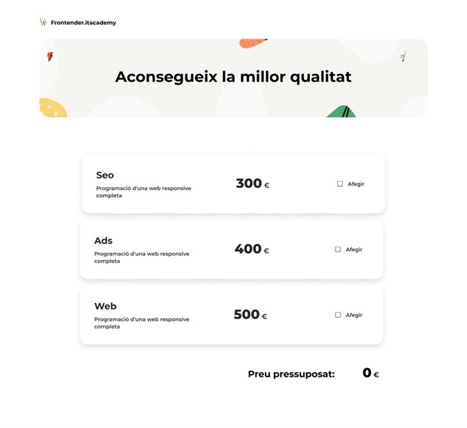
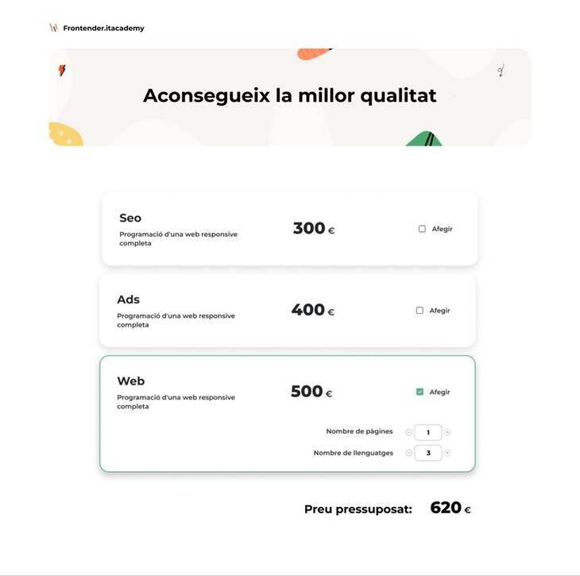
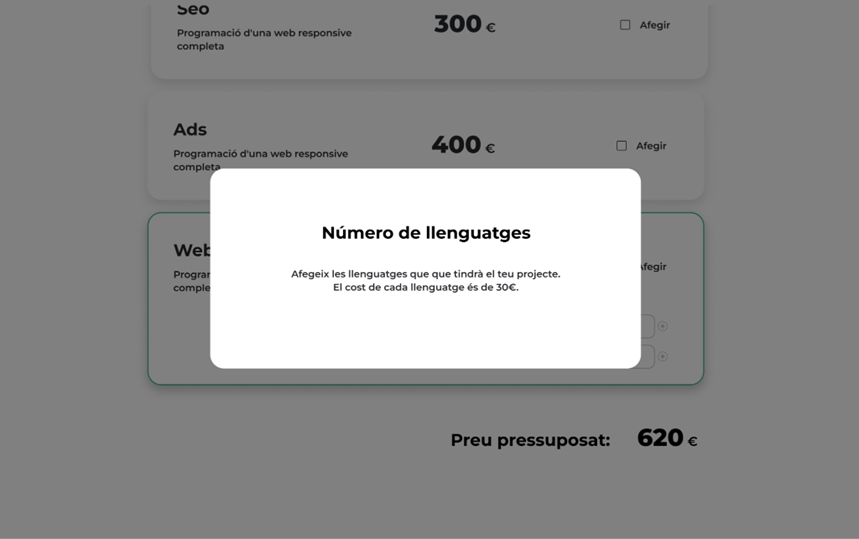
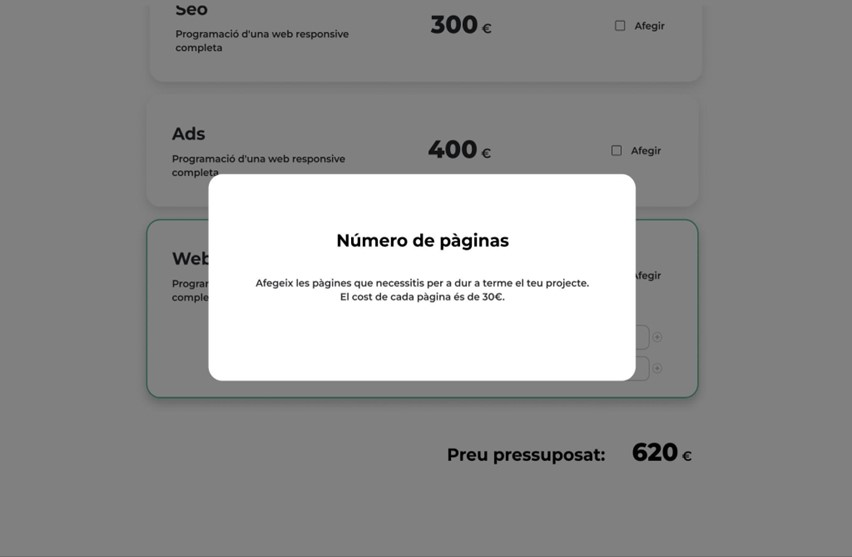
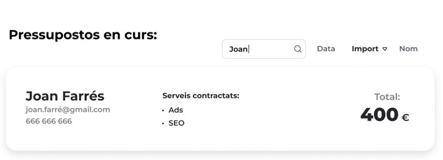
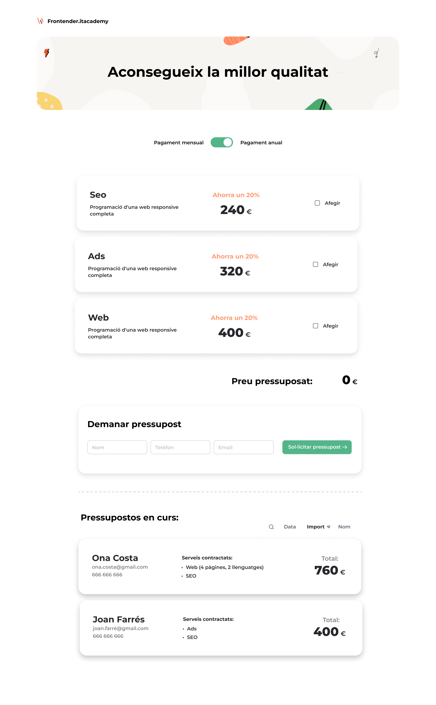

# S6 Pressupostos React + Vite

En aquesta entrega, desenvoluparem una aplicació amb l'objectiu d'agilitzar
els càlculs per al pressupost d'un lloc web, incrementant la interacció amb
l'usuari/ària encomparació amb la pràctica anterior, mitjançant l'ús de
caselles de selecció, camps d'entrada (inputs) i botons.

El nostre lloc web haurà de respondre i ajustar el preu total en funció
de les opcions seleccionades per l'usuari/ària.

## Nivell 1

### Exercici 1

La nostra aplicació començarà amb tres checkboxes. D'aquesta manera,
l'usuari/ària haurà de decidir quins serveis necessita per confeccionar
el pressupost.

1. Fer una campanya SEO (300 €)

2. Fer una campanya de publicitat (400 €)

3. Fer una pàgina web (500 €)

En funció de les opcions que marqui, es modificarà el preu.

Desenvoluparem un formulari reactiu amb els 3 productes. En funció de les opcions modificades el preu canviarà.

### Exercici 2

Una vegada creades les caselles de selecció que permetran a l'usuari/ària seleccionar el tipus de servei que necessita, li proporcionarem l'opció d'ajustar un dels serveis: crear una pàgina web, podent triar el nombre de pàgines i d'idiomes.

Per això, cal definir un component que serà visible quan el client/a seleccioni que vol pressupostar una pàgina web. Dins d'aquest component, el client/a podrà seleccionar el número de pàgines i el número d'idiomes de la web que desitja fer.

Calcular el cost del pressupost total i el cost total del web seguint la següent fórmula:  ( Nombre de pàgines + el nombre d'idiomes ) * 30€.

### Exercici 3

GENIAL!, l'usuari/ària ja pot demanar 3 dels nostres serveis i personalitzar un d'ells.

Per facilitar la introducció de dades per part de l'usuari, crea dos botons als costats dels camps de pàgines i llenguatges.

Aquests botons permetran a l'usuari augmentar o disminuir la quantitat en una unitat.

### Exercici 4

Per acabar aquesta primera fase del projecte, és necessari implementar una pantalla de benvinguda a l'usuari/ària, on s'expliqui el propòsit i el funcionament de la web.

Implementa un botó a la pantalla de benvinguda que redirigeixi l'usuari/ària a la pantalla principal de la calculadora.

També implementa un botó a la pantalla de la calculadora que redirigeixi l'usuari/ària a la pantalla de benvinguda.

### Exercici 5

Ja has completat la web, però només funciona per fer un únic pressupost. Com aquesta web està pensada perquè també els programadors/es freelance puguin generar els seus pressupostos, falta oferir aquesta opció als usuaris/àries perquè puguin generar diversos pressupostos.

Per això, hauràs d'afegir tres inputs: nom de pressupost i client/a, que juntament amb el servei seleccionat per l'usuari/ària i el preu total calculat, s'haurà d'afegir a un llistat de pressupostos.

## Nivell 2

### Exercici 6

Sempre hi ha usuaris/àries despistats/es que podran usar la teva web de pressupostos. Per a garantir que tothom entén el significat dels inputs de nombre de pàgines i d'idiomes, hauràs d'implementar un botó que obri un popup d'ajuda.

Mostrar el missatge d'ajuda amb els modals de Bootstrap o tailwind sent el botó que facilita una icona d'informació:

### Exercici 7

Hi ha un problema amb el llistat de pressupostos, costa trobar els pressupostos quan n'hi ha molts, ja que no existeix cap mena de filtre, cercador o opció d'ordenar el llistat.

En aquest exercici hauràs d'implementar 3 botons en la part superior del llistat, els quals efectuen les següents tasques:

1. Botó ordenar alfabèticament els pressupostos.
2. Botó ordenar per data els pressupostos.
3. Botó reinicialitzar ordre.

### Exercici 8

Mitjançant l'ordenació dels pressupostos a partir de l'exercici anterior, es faciliten i potencien les funcionalitats de la web. No obstant això, hi ha més opcions per millorar i obtenir més beneficis.

Es necessita implementar un cercador de pressupostos, el qual cerca en tots els noms dels pressupostos per a mostrar només els que concorden.

### Exercici 9

És necessari afegir la possibilitat als usuaris/àries de sol·licitar un pressupost anual, aplicant un descompte del 20% sobre el preu.

Implementa el botó per poder activar/desactivar el descompte, i modifica la interfície per mostrar que s'està aplicant el descompte.

## Nivell 3

### Exercici 10

Per finalitzar, és imprescindible oferir a l'usuari/ària la capacitat de compartir l'URL d'un pressupost perquè d'aquesta manera, el receptor/a pugui visualitzar la pantalla emplenada.

En moltes ocasions, un servei es contracta per recomanació, per la qual cosa és fonamental tenir-lo implementat.

Seleccionant cadascuna de les opcions del pressupost, l'URL de la mateixa ha de canviar en funció d'aquests canvis. D'aquesta manera, si el client/a comparteix l'URL amb algú, aquest podrà visualitzar les mateixes opcions del pressupost.

Exemple: -> [http://localhost:4200/home?WebPage=true&CampaingSeo=true&pages=1&lang=2]
